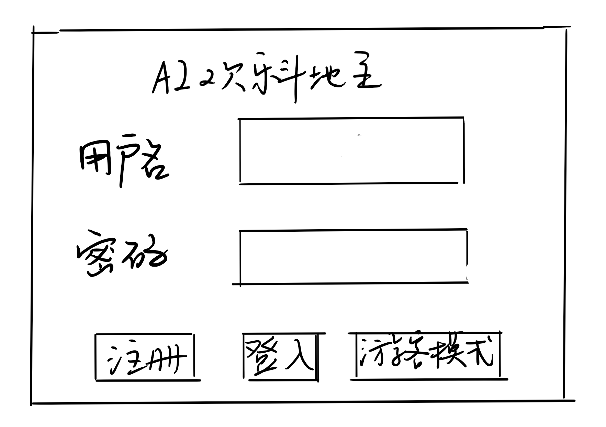
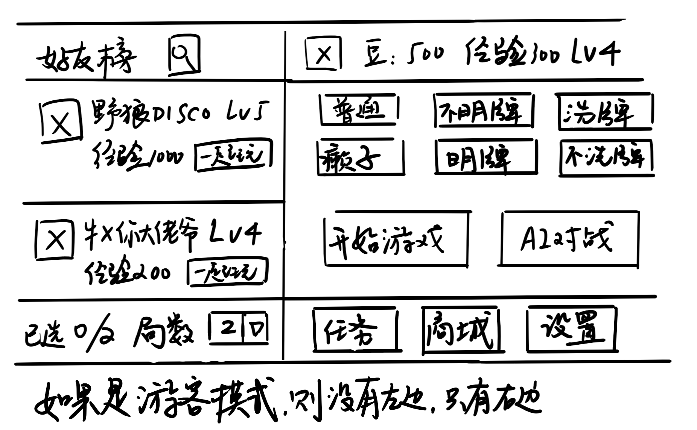
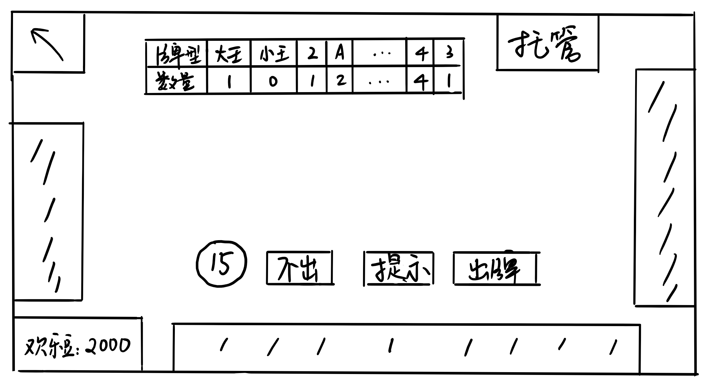

## 功能点

* 登录注册
* 添加好友，并显示排名，好友组队。
* 随机组队
* 商城 买豆子买道具，包括单局记牌 一天记牌 双倍欢乐豆 连胜符
* 每日领豆子做任务，包括打出3带个数，飞机经典模式玩35局，抢地主次数 连胜xx次
* 可变的模式，包括癞子模式，不洗牌模式，明牌模式
* 游客模式
* 记住用户名/密码
* 规则原理
  * 基于模型的和基于训练的

## 数据表

* 用户 昵称 id 胜场 输场 注册时间 用户名 密码 经验 金币
* 对战记录
* 好友join表
* 活动表 活动组id 个人id 最终排名 负于xx
* 研究平台的表格
* 任务系统，每日更新

## 用例

### 对局过程

* 对局开始前
  * 后端查询，仓库中的商品有多少，并返回给前端
  * 如果一个商品没有，则显示购买，否则显示使用。
    * 对于一天记牌器等，如果已经使用了，那么使用的按钮不可点击。
  * 点击使用后可以撤销。直到点击开始游戏之后，才向后台发送使用请求。
* 匹配玩家
  * 牌局选项一共有3个按钮，一共可以组成2^3=8个牌局选项，因此，我们需要在后台构建8个池子。
  * 一旦玩家进入
* 抢地主
  * 向第一个玩家询问是否需要抢地主。
    * 等待时间10秒。如果玩家没有按时选择，则默认不抢地主。
    * 其他人显示该人剩余的秒数。
  * 可以把数秒当成一个迭代点
  * 如果三个人都没有选择地主，则默认第一个人为地主。
    * 后续：可以重新发牌，让大家重新选。如果三轮都没有人选择，默认是第一个人为地主。
* 出牌
  * 如果第一次出牌，或者一轮刚结束，则只显示出牌按钮。
  * 否则在牌局进行中，显示 不出 提示 出牌 三个按钮
  * 后续：出牌的人显示数秒，时限10s。
    * 其他用户也可以看到数秒。
    * 在如果第一次出牌，或者一轮刚结束时，默认按电脑提示的出牌。
    * 如果在牌局进行中，默认不出。
* 托管
  * 前端变为”退出托管“
  * 程序会在后台记录该操作。
  * 轮到它时，前端不显示操作栏（数字 不出 提示 出牌），直接由后端计算结果，并返回给各个前端
  * 需要在每局对战结束后清除前后端托管状态
* 对局结束后
  * 后端计算欢乐豆。规则
    * 倍数乘底分20是初始每个人的欢乐豆
      * 初始的倍数为15
      * 如果成为地主，则倍数加倍
      * 如果有一个玩家使用了炸弹，则所有人的倍数加倍
    * 如果计算出来的扣减的欢乐豆，已经超过了用户的欢乐豆，则最多扣到用户的欢乐豆为0为止。
  * 后端计算经验值。规则
    * 赢的人经验+200；输的人经验-100
  * 前端显示每个人欢乐豆和经验值的增减结果
    * 赢了显示连胜次数
    * 输了显示连胜符的购买链接，以及是否使用
  * 回到对局开始前的界面，但加入“换桌开始”

### 好友模式

* 添加好友
  * 点击主页面的加好友按钮，弹出一个新web窗口
  * 在这个界面可以搜索好友，以模糊搜索的方式显示结果。
  * 点击添加好友，可以加好友
* 主页面的好友列表
  * 按照经验值排名。
  * 可以选择一起玩。这个选择记录在前端。
    * 但要求保存这个数据。如果刷新该页面，依旧可以看到好友的选择。
    * 但如果退出账号后，该数据应该被删除。
    * 开始对战后，删除一起玩的选择数据。
* 好友详情页
  * 点击好友头像，可以进入好友详情页，可以看到好友当前的信息（在数据库：用户表中的信息）
  * 点击“删除好友“，可以删除好友。
    * 之前选择的“一起玩的好友”，数字将减少。

### 道具

* 记牌器
  * 分为一天记牌卡和单局记牌卡
  * 显示点：抢地主结束，第一张牌出牌前。
    * 后端检查是否使用一天记牌卡，或者单局记牌卡（注意使用和拥有是不一样的）
    * 如果有的话，则显示
  * 由前端计算。我方出牌信息由前端提供；其他两者由网络通信端提供。
* 双倍经验卡
  * 分为一天双倍卡和单局双倍卡
  * 双倍经验卡同记牌卡一样，在对局开始前使用。
    * 如果赢了，则经验值加倍。如果输了，则经验值不减少。
* 加倍卡
  * 在抢地主结束，第一张牌出牌前使用。
  * 使用之后，会在其他电脑上显示加倍。
  * 如果是地主加倍，则所有农民倍数也翻翻。如果是农民加倍，则地主倍数加上加倍农民原来的倍数。
* 连胜符
  * 在输的结果结果实现页面上显示
  * 使用连胜牌之后，经验不扣取的结果，显示在其他用户的最终结果页面上，如果页面还没有关上的话
* 注意：一天和单局道具
  * 如果在某一天的晚上10点使用该道具，则该道具的使用时长不是2小时，而是24小时。
  * 如果已经使用了一天道具，则单局道具无法使用（在对局开始前的界面上）
  * 一天和单局道具，无法同时被选择

## 效果构想图

### 修改

* 示例图里面加倍数
* 好友详情
* 一个问题，HTML似乎无法实现两个元素在同一个位置上。
  * 最终结果页面

